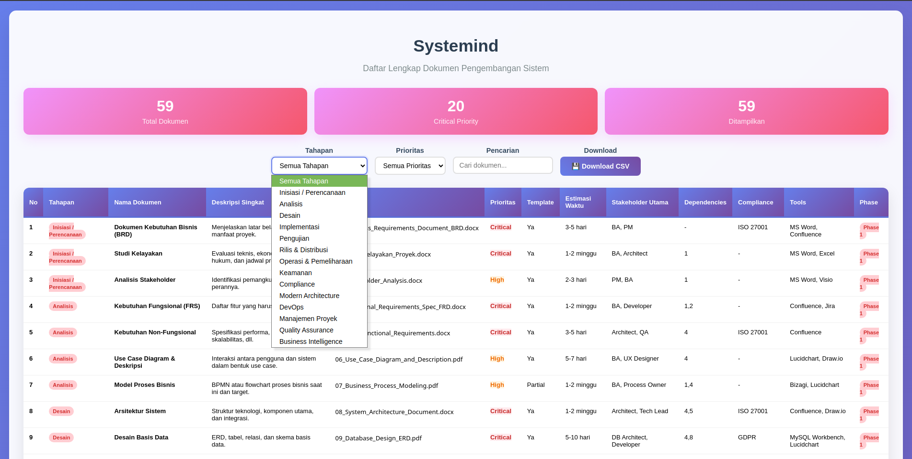

# [Systemind](/faq.md)
Dokumen dan Template (Design Document Templates) Untuk Akselerasi Pengembangan Sistem dengan AI Pairing

Dibuat untuk : Founder, SoloPreneur, Indie Maker, CTO (Chief Technology Officer), Digital Transformation Specialist, IT Team Leader, [Software Architect](https://roadmap.sh/software-architect), Full-stack, Software Engineer, Vibe Coder, Technical Writer, Solution Architect

## Trigger

Awalnya saya ngalir aja dari cerita ini di [threads saya](https://www.threads.com/@irfnrdh/post/DKtYpGnSuvl)  

Apa yang membuat saya membuat repository ini,  
bermula dari pertanyaan sederhana.

> dokumen apa saja yang dibutuhkan saat merancang sistem aplikasi sampai selesai sampai bisa dipakai didistribusi digunakan dan sebelum masuk fase upgrade

lalu berlanjut ke **Enhanced Version**

## Dokumen

| Kolom Baru | Deskripsi | Contoh |
|------------|-----------|---------|
| **Prioritas** | Tingkat kepentingan dokumen (Critical/High/Medium/Low) | Critical, High, Medium, Low |
| **Template Tersedia** | Apakah ada template standar yang bisa digunakan | Ya/Tidak/Partial |
| **Estimasi Waktu** | Perkiraan waktu pengerjaan dokumen | 2-4 hari, 1-2 minggu |
| **Stakeholder Utama** | Siapa yang bertanggung jawab utama | BA, Architect, Developer, QA |
| **Dependencies** | Dokumen lain yang harus selesai terlebih dahulu | Dokumen #1, #3 |
| **Review Status** | Status review dan approval | Draft/Review/Approved |
| **Frequency Update** | Seberapa sering dokumen perlu diupdate | Once/Per Sprint/Monthly/Quarterly |
| **Compliance Required** | Apakah wajib untuk compliance tertentu | ISO 27001, GDPR, PCI-DSS |
| **Tool/Platform** | Tools yang direkomendasikan untuk membuat dokumen | Confluence, Notion, SharePoint |
| **Size Category** | Ukuran kompleksitas dokumen | Small/Medium/Large/Enterprise |

### 🔄 **Phase-Based Categorization** :

1. **Pre-Development (Inisiasi)**
   - Business requirements, feasibility, stakeholder analysis

2. **Planning & Architecture**
   - System architecture, database design, security planning

3. **Development & Implementation**
   - Coding standards, API docs, implementation guides

4. **Quality Assurance**
   - All testing documents, quality gates

5. **Deployment & Operations**
   - Deployment guides, monitoring, maintenance

6. **Governance & Compliance**
   - Legal, compliance, audit documents

7. **Continuous Improvement**
   - Monitoring, optimization, roadmap

## 💡 **Rekomendasi Implementasi:**

1. **Prioritaskan dokumen berdasarkan ukuran dan kompleksitas proyek**
2. **Buat template standar untuk dokumen yang sering digunakan**
3. **Implementasikan review workflow untuk dokumen critical**
4. **Gunakan tools kolaborasi modern (Notion, Confluence, GitBook)**
5. **Otomatisasi generation dokumen yang bisa di-generate dari code**
6. **Regular audit terhadap relevansi dan update dokumen**

---

*Catatan: Daftar ini dapat disesuaikan berdasarkan metodologi pengembangan (Agile, Waterfall, DevOps) dan kompleksitas proyek (Small, Medium, Enterprise).*

## Insight
- https://arc42.org/
- https://www.openproject.org/
- https://c4model.com/
